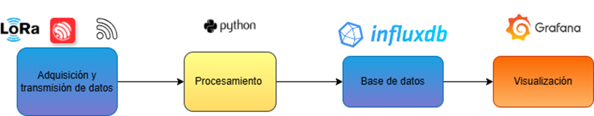
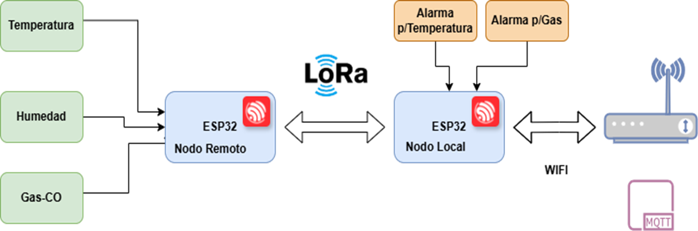
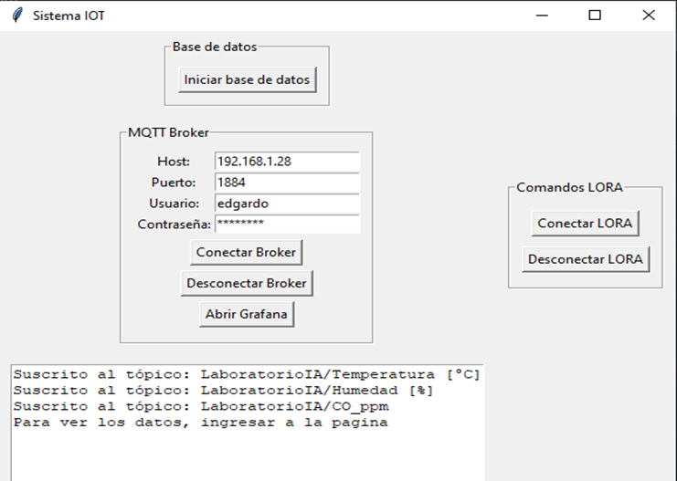
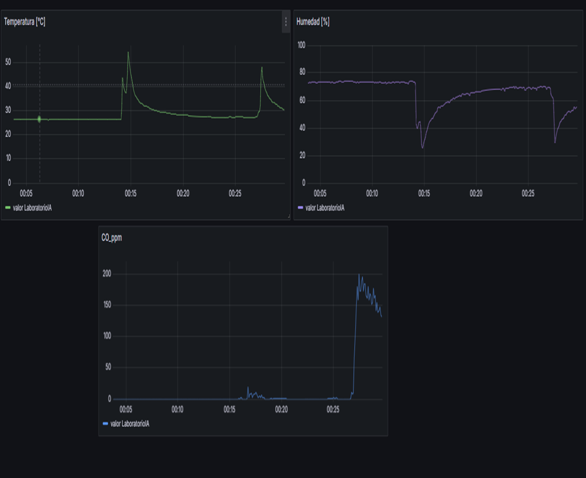

# IOT aplicado a ODS

## Resumen
En este trabajo, se presenta un desarrollo tecnológico realizado en el marco de las Becas EVC-CIN 2022, el cual tuvo como objetivo principal diseñar e implementar un sistema de monitoreo ambiental basado en tecnología IoT utilizando el enlace LoRa (Long Range). El proyecto se enfocó en los Objetivos de Desarrollo Sostenible (ODS) 11 (Ciudades y comunidades sostenibles) y 13 (Acción por el clima), integrando sensores para medir temperatura, humedad y gases como el monóxido de carbono, entre otros parámetros.
El sistema consta de una red compuesta de dos nodos construidos con módulos de desarrollo TTGO-LoRa V2.0, basados en el microcontrolador ESP32, y una unidad central para procesar y visualizar los datos en tiempo real.

En función de los objetivos propuestos se realizaron las siguientes actividades de investigación y desarrollo.
1. Selección de sensores: Se investigaron y seleccionaron dispositivos adecuados para abordar los ODS mencionados.
2. Implementación del enlace LoRa: Se utilizó la librería Arduino-LoRa para establecer comunicaciones de largo alcance. Las pruebas, realizadas en el Centro Universitario Ing. Roberto Herrera, midieron la intensidad de la señal recibida (RSSI) en función de la distancia. Se logró una transmisión eficiente hasta 425 m en línea recta despejada, validando el sistema para aplicaciones como la prevención de incendios agrícolas y el monitoreo de humedad en el suelo.
3. Transmisión de datos: Para enviar los datos a la unidad central, se aprovechó el módulo Wi-Fi del ESP32 y el protocolo MQTT.
4. Visualización y almacenamiento: Se desarrolló una interfaz gráfica en Python con Tkinter para gestionar los datos, que se almacenaron en una base de datos InfluxDB y se visualizaron mediante Grafana.
El resultado fue un sistema IoT funcional y eficiente, capaz de capturar, transmitir y analizar datos ambientales de manera confiable.

## Diagramas






## Interfaz Gráfica




## Librerias Python

```
influxdb-client==1.49.0
paho-mqtt==2.1.0
```